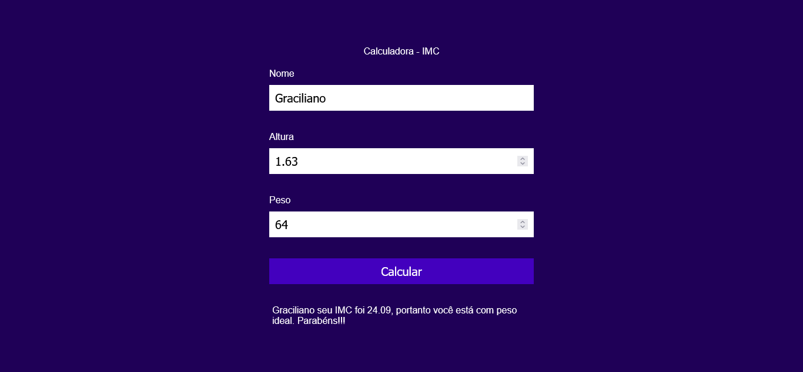

# Calculator IMC

> This is a project to increase my knowledge in Javascript

## Índice

- [Overview](#overview)
  - [The challenge](#the-challenge)
  - [Screenshot](#screenshot)
  - [Links](#links)
- [My process](#my-process)
  - [Built with](#built-with)
  - [What I learned](#what-i-learned)
  - [Continued development](#continued-development)

## Overview

### The challenge

Users should be able to:

- Enter your height and weight and receive a result with your BMI according to the World Health Organization.

### Screenshot




### Links

- Live Site URL: [Calculator IMC](https://github.com/Graciliano-Barroso/calculadora-imc)

## My process

### Built with

- Semantic HTML5 markup
- CSS custom properties
- Javascript

### What I learned

In this project I learned how to calculate and the importance of validation and I realized that this technique will be repeated in other projects.

Below we can see how the validation was done:

```html
<button class="div-calc" id="calcular">Calcular</button> 
```
```js
let buttonCalcular = document.querySelector('#calcular');

buttonCalcular.addEventListener('click', ()=> {
    let nome = document.querySelector('#nome').value;
    let altura = document.querySelector('#altura').value;
    let peso = document.querySelector('#peso').value;
    let resultado = document.querySelector('#resultado');

    if (nome !== '' && altura !== '' && peso !== '') {

        let calculoIMC = (peso / (altura * altura)).toFixed(2);

        let classification = "";

        if (calculoIMC < 18.5) {
            classification = 'abaixo do peso.'
        }else if (calculoIMC < 25) {
            classification = 'com peso ideal. Parabéns!!!'
        }else if (calculoIMC < 30) {
            classification = 'levemente acima do peso.'
        }else if (calculoIMC < 35) {
            classification = 'com obesidade grau I.'
        }else if (calculoIMC < 40) {
            classification = 'com obesidade grau II.'
        }else {
            classification = 'com obesidade grau III. Cuidado!!!'
        }

        resultado.textContent = `${nome} seu IMC foi ${calculoIMC}, portanto você está ${classification}`;

    }else {
        resultado.textContent = 'Preencha todos os campos';
    }
});
}
```

### Continued development

The idea is to continue increasing my knowledge in Javascript and increasing the complexity of the projects for my development and to be able to make projects with more functionality.
